# Acciones

## Categorías

Las categorías permiten identificar de una forma amigable y fácil a los micrositios que se agregan a la plataforma de Placetopay.

Para ingresar a un micrositio por categoría solo tiene que ir a la Url [https://sites.placetopay.com/](https://sites.placetopay.com/) y desde allí puedes:

* Ver alguna de las categorías creadas seleccionando el botón **Ver comercios** y así inmediatamente se listan los micrositios que se asocian a esta categoría en el momento de la creación del micrositio por el administrador de la plataforma, donde puedes ir a la sesión que permite ingresar al micrositio para realizar un pago.

* También puedes buscar un micrositio por su nombre o por alguna palabra que haga parte de este, ingresando el dato en el campo **Nombre del micrositio** que se expone en la vista de la url mencionada anteriormente, inmediatamente el sistema te mostrará aquellos que la contengan.

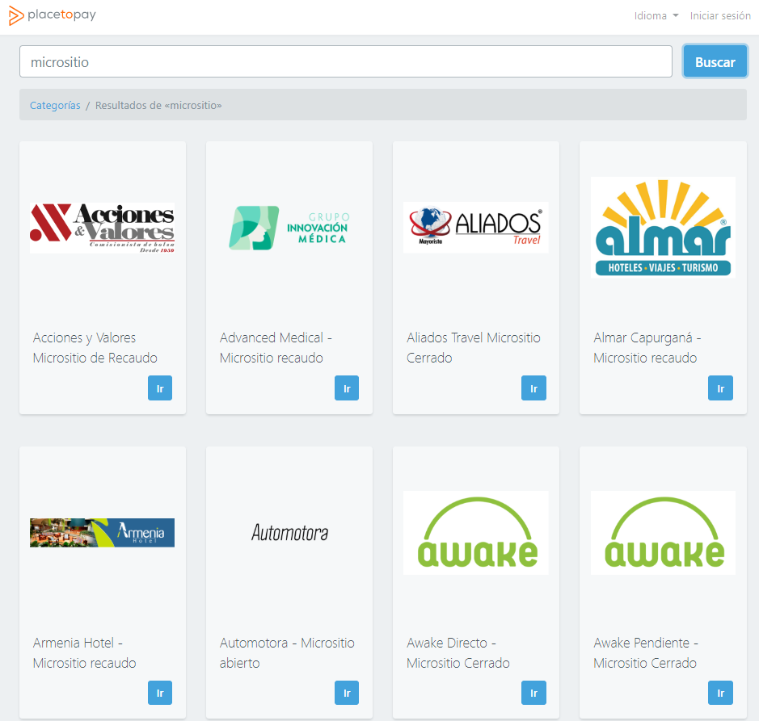

Las [categorías](/administrator_role/settings.md#categorias) son configuradas por el administrador del servicio desde la plataforma administrativa de los micrositios.

## Micrositios cerrado

Cuando el usuario [Ingresa a un micrositio cerrado](/user_end/README.md#micrositio-cerrado) se listan las facturas relacionadas que están pendientes de pago  y el historial de pagos de las diferentes facturas.

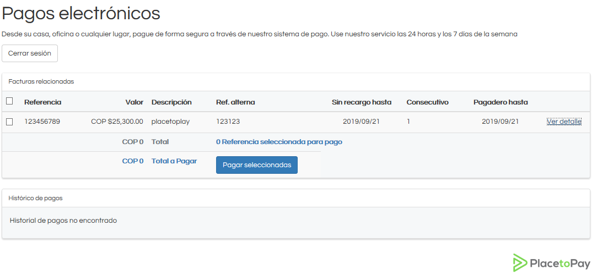

Dependiendo de la configuración que se le realice en el momento de la creación del micrositio este puede tener diferentes características y funcionalidades al momento de visualizar la lista de facturas pendientes de pago o realizar un pago.

### Detalle de factura

El sistema permite por cada registro de factura pendiente de pago visualizar toda la información que se tenga de estas en la consola de Placetopay.

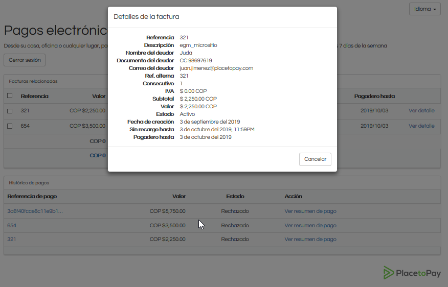

### Pagar

El sistema permite redireccionar al cliente a la [**plataforma de pago**](/user_end/actions.md#plataforma-de-pago) en el momento que éste seleccione una o varias facturas pendientes de pago y posteriormente el botón **Pagar Seleccionadas** .

Inmediatamente el sistema redirecciona al usuario a la [**plataforma de pago**](/user_end/actions.md#plataforma-de-pago)  donde puede realizar este proceso. Al terminar la transacción el usuario debe dar clic en **regresar al comercio** y de esta manera el sistema permite ver el detalle de la referencia de pago con las facturas relacionadas a este.

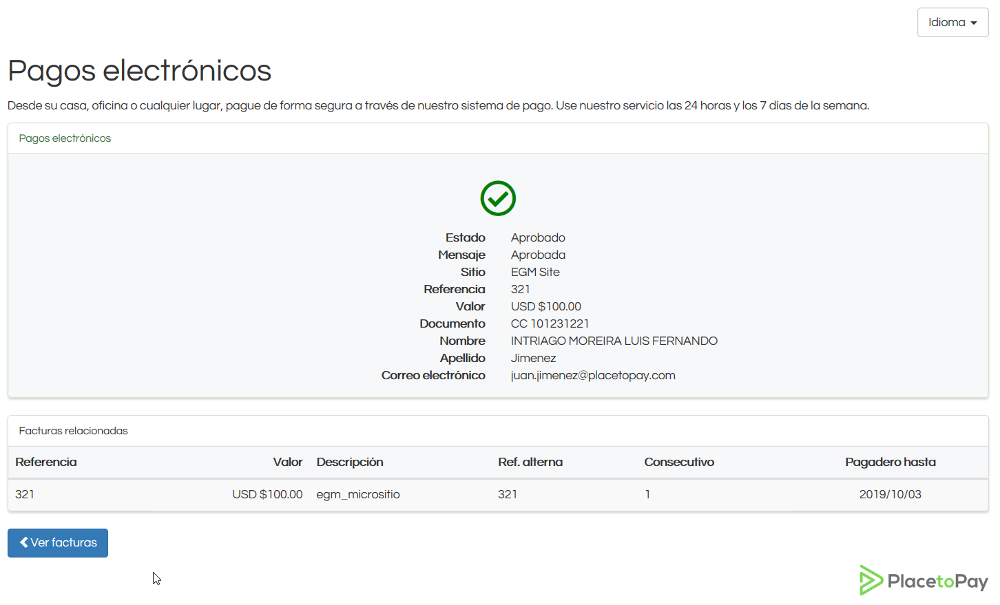

Finalmente el usuario debe seleccionar el botón **Ver factura** y de esta manera regresa a la pagina donde inicio el pago donde verá el registro en el **Histórico de pagos**

### Histórico de pagos

La plataforma permite visualizar el histórico de pagos de aquellos que inician o terminan un proceso de pago desde el micrositio para así llevar una trazabilidad de los mismos.

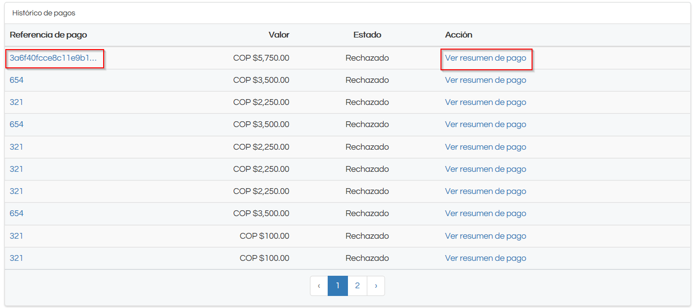

* Cuando se inicia un proceso de pago y se han seleccionado más de una factura para realizar un pago la referencia de pago del histórico es autogenerada, en caso de que se pague solo una de las facturas pendientes se asigna en la referencia el número de de referencia de la factura.

* Desde la vista del **Histórico de pagos** se puede acceder al detalle de la referencia de pago con solo seleccionar el número de referencia que se quiere visualizar.

* Al seleccionar una acción se puede visualizar el estado de la transacción que se genera desde la [**plataforma de pago**](/user_end/actions.md#plataforma-de-pago).

## Micrositio abierto

Después de que el usuario ingrese todos los datos en el formulario de acceso ya puede proceder con el pago donde accede directamente a la [**plataforma de pago**](/user_end/actions.md#plataforma-de-pago) y debe realizar el proceso transaccional para el pago de una factura que referencia con los datos que se diligencian en el formulario de [Ingreso a la sesión](/user_end/README.md#micrositio-abierto).

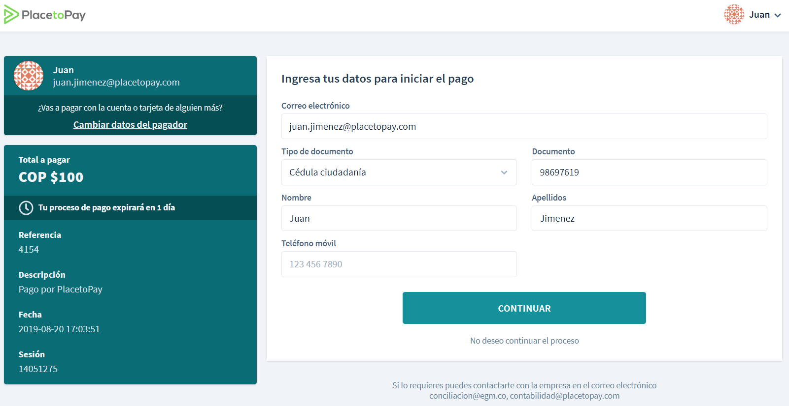

Desde esta página ya puede hacer uso de las funcionalidades que la [**plataforma de pago**](/user_end/actions.md#plataforma-de-pago) como servicio transaccional brinda.

## Micrositio personalizado

Cuando el usuario accede a un micrositio personalizado este puede ver las facturas pendientes de pago de acuerdo a su configuración  en el momento de la creación, también puede visualizar el historial de pagos de sus facturas.

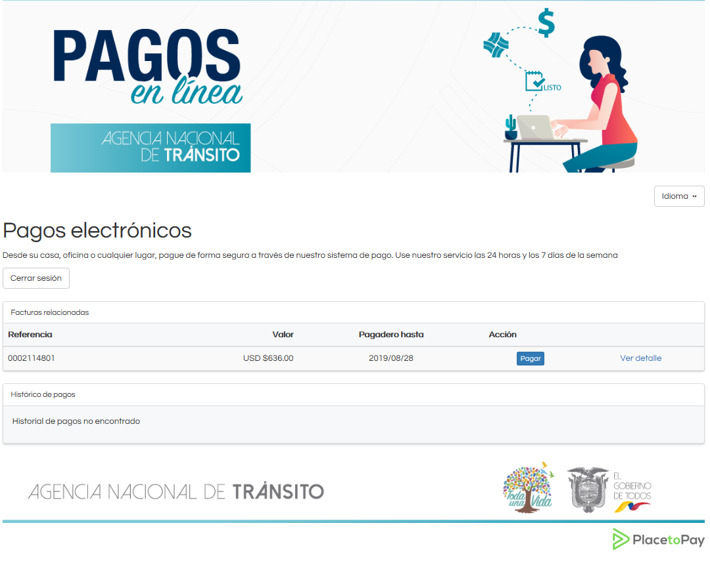

### Detalle de factura

El sistema permite por cada registro de factura pendiente de pago visualizar el detalle de la misma, el cual es consultado en la base de datos del comercio. 

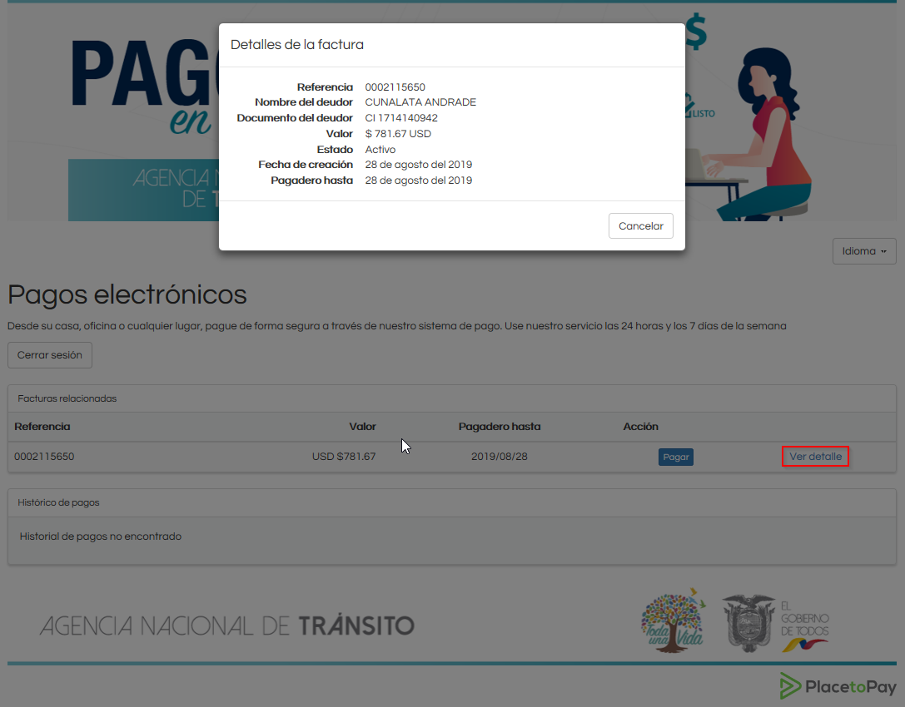

### Pagar

Cuando desee pagar una factura debe seleccionar el botón **Pagar** y posteriormente el sistema genera un detalle de pago para que confirme la referencia y monto a pagar.

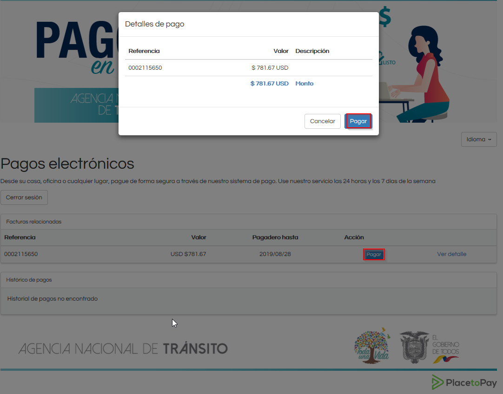

Posteriormente el sistema redirecciona al usuario a la [**plataforma de pago**](/user_end/actions.md#plataforma-de-pago)  donde puede realizar este proceso. Al terminar la transacción el usuario debe dar clic en **regresar al comercio** y de esta manera el sistema permite ver el detalle de la referencia de pago con las facturas relacionadas a este.

Finalmente el usuario debe seleccionar el botón **Regresar al micrositio** y de esta manera regresa a la pagina donde inicio el pago donde verá el registro en el **Histórico de pagos**

### Histórico de pagos

La plataforma permite visualizar el histórico de pagos de aquellos que inician o terminan un proceso de pago desde el micrositio para así llevar una trazabilidad de los mismos.

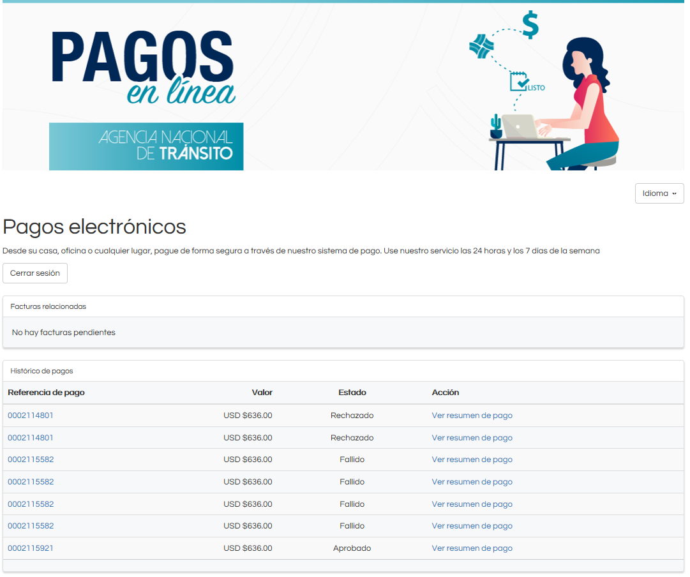

### Estados de una transacción

Un pago puede presentar varios estados todo depende de que el usuario termine todo el proceso de pago adecuadamente o no se presenten fallas en el flujo transaccional.

**Aprobado:** Cuando el proceso transaccional es exitoso se aprueba la transacción.  
**Fallido:** Cuando se inicia el proceso de pago y no es posible continuar por un error del sistema o en configuración.  
**Rechazado:** Cuando el proceso de pago a expirado, o se cancela la transacción.  
**Pendiente:** Cuando una transacción no ha sido aprobada por riesgo de fraude o no hay comunicación con la red procesadora.  
**Proceso iniciado:** Cuando se inicia un proceso de pago y no a expirado la sesión o no se a cancelado el pago.  

* Cuando el estado de una transacción es **Proceso iniciado** el usuario puede desde el historial de pagos realizar la acción de **Continuar con el pago** 

Esto permite al usuario seguir con la sesión que había iniciado el proceso de pago.

* En caso de que la sesión expire por tiempo de inactividad o se presente otro estado en el proceso de pago, desde el historial de pago se permite realizar la acción **Ver resumen de pago** y de esta manera se puede ver el resumen de la transacción.

#### Detalle de un pago

El sistema permite desde cada registro del histórico de pagos ver por medio de la referencia el detalle de un pago electrónico.

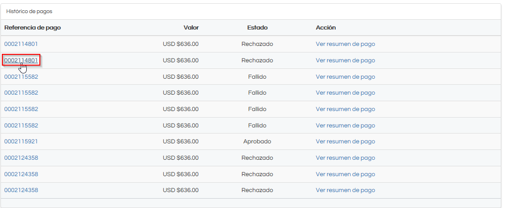

En este detalle se puede visualizar el registro del pago electrónico gestionado.

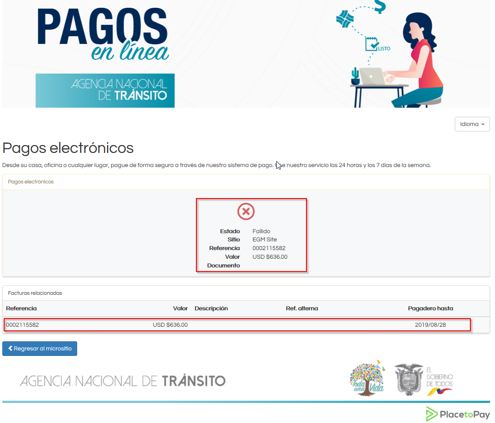

## Micrositio externo 

Un micrositio externo permite al usuario desde una categoría ingresar a una url configurada previamente en el momento de la creación del micrositio y de esta manera redireccionar a un usuario al sitio deseado por el comercio.

Para ingresar a un micrositio externo desde  [sites](https://sites.placetopay.com/) identificas la categoria que contiene el micrositio, seleccionas el botón **Ver comercio**.

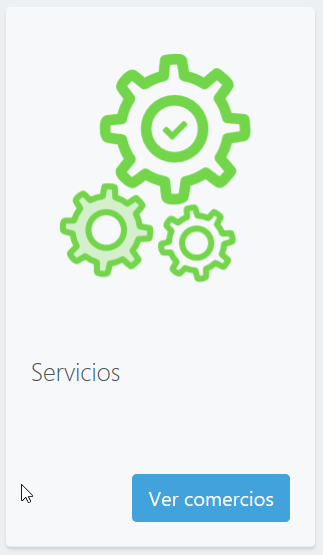

Posteriormente debes buscar el micrositio y seleccionar el botón **Ir** 

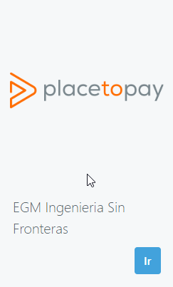

Inmediatamente el sistema debe direccionar al sitio configurado.

## Plataforma de pago

Por este medio un usuario puede realizar una transacción para lograr realizar un pago de sus responsabilidades financieras. Donde inicialmente el sistema le solicita un correo electrónico donde se notifica al usuario la aprobación del pago.

Inmediatamente después el sistema solicita ingresar algunos datos personales del usuario para poder iniciar el pago.

Al continuar con el pago, el usuario debe seleccionar el medio de pago e ingresar inmediatamente después los datos que solicita el sistema dependiendo del medio de pago seleccionado.

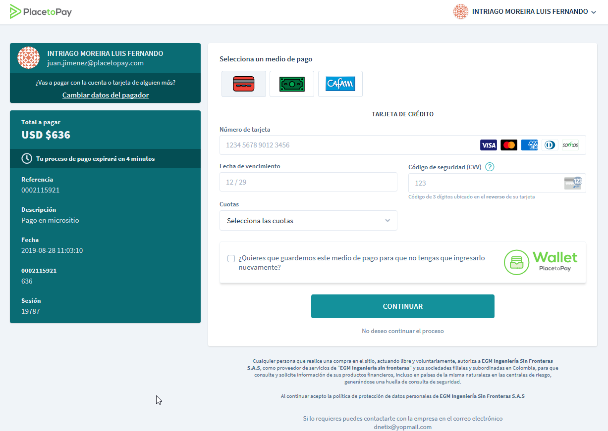

Finalmente el sistema genera la aprobación o rechazo de la transacción.

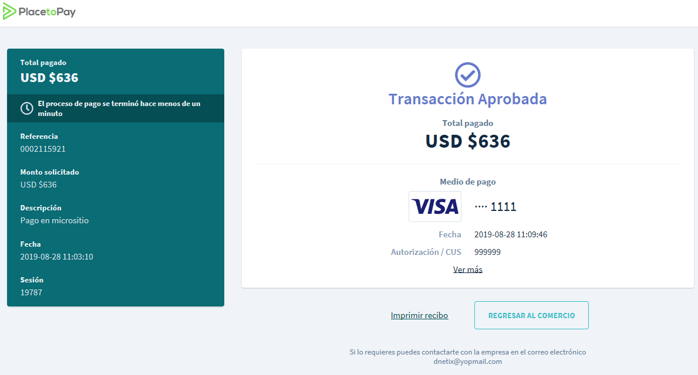

Adicionalmente envía al correo ingresado al inicio un reporte de la transacción.

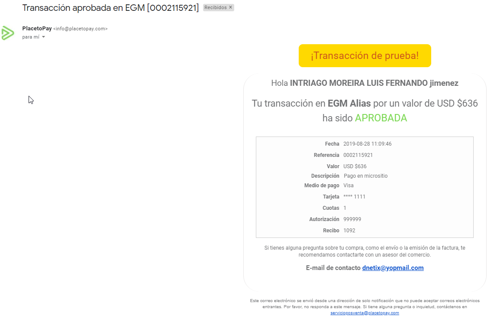